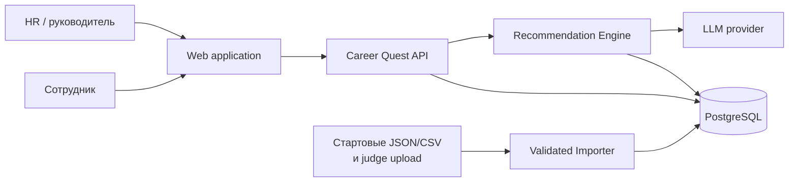
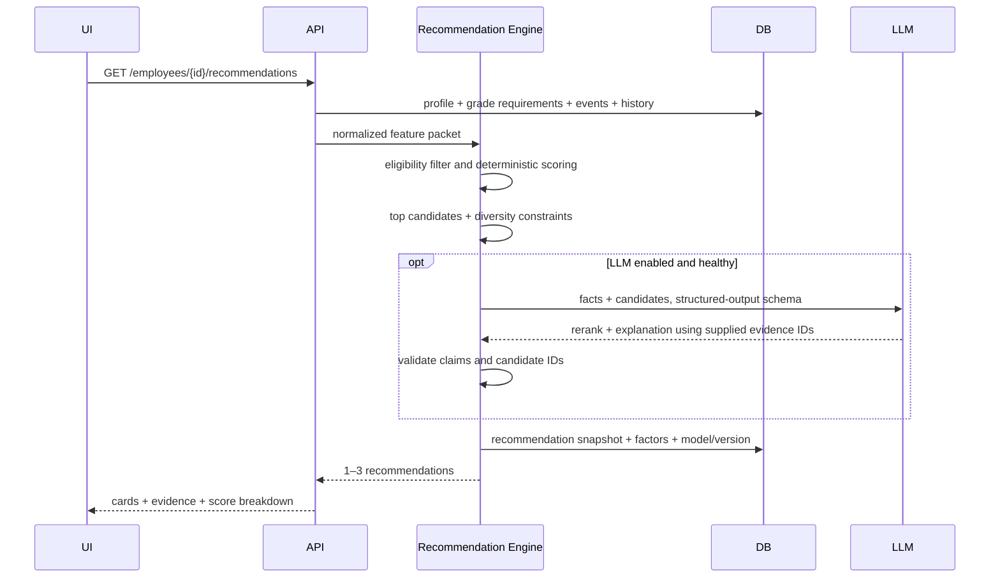
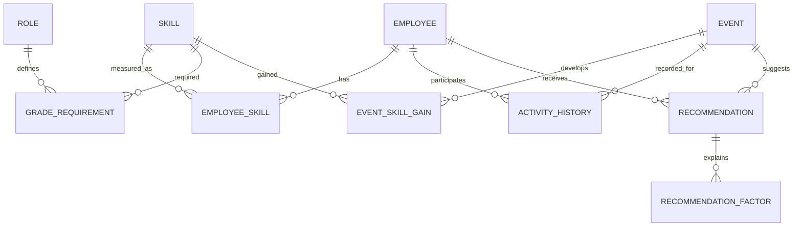

# Архитектура Career Quest

## 1. Цели и границы MVP

MVP закрывает два сценария:

1. **Employee:** открывает профиль, видит текущий и следующий грейд, skill gaps, историю, 1–3 шага с объяснением; завершает активность и сразу видит пересчитанный прогресс.
2. **HR:** видит агрегированные проседающие навыки, participation/completion rate и сотрудников без доступного шага.

В MVP не входят баллы, магазин наград, social leaderboard и retention prediction. Они не должны отвлекать от качества рекомендаций.

## 2. Контекст системы



LLM не имеет прямого доступа к БД. Он получает минимальный псевдонимизированный feature packet и возвращает строго валидируемый JSON.

## 3. Контейнеры

| Компонент | Ответственность | Планируемый стек |
|---|---|---|
| Web | Employee profile/trajectory, recommendations, completion action, HR dashboard, RU/KK/EN | Next.js, TypeScript, Tailwind, TanStack Query |
| API | Auth/RBAC, admin, CRUD, imports, progress transaction, HR aggregates, orchestration | Django, Django REST Framework, Django ORM |
| Recommendation Engine | Feature building, eligibility, scoring, diversity, optional LLM rerank/explanation | Python service module inside API |
| Database | Profiles, skills, requirements, events, history, recommendation audit | PostgreSQL |
| LLM adapter | Provider-neutral structured output, timeout, retry, fallback | OpenAI-compatible client |
| Importer | JSON/CSV schema validation, dry-run, atomic replace/upsert, error report | DRF serializers + stdlib JSON/CSV |

Для хакатона это **модульный монолит**, а не набор микросервисов: один API process, одна БД, явные границы модулей. Это даёт запуск одной командой и не мешает позже вынести Recommendation Engine.

## 4. Поток рекомендации



### 4.1 Candidate eligibility

Событие попадает в candidates, если:

- подходит по role/grade/audience и языку;
- доступно и ещё не завершено (если не repeatable);
- развивает хотя бы один навык с текущим уровнем ниже `max_level`;
- соблюдены prerequisites и capacity/deadline.

### 4.2 Explainable base score

Для каждого candidate считается нормированный score:

```text
score = 0.40 * next_grade_gap_coverage
      + 0.20 * critical_skill_priority
      + 0.15 * achievable_gain
      + 0.15 * participation_affinity
      + 0.10 * recency_and_availability
      - repeat_penalty
      - skip_pattern_penalty
```

- `next_grade_gap_coverage`: какую долю взвешенного gap следующего грейда закроет activity с учётом `gain` и `max_level`;
- `critical_skill_priority`: вес навыка для целевого грейда;
- `achievable_gain`: реальное, а не заявленное приращение после cap;
- `participation_affinity`: completion rate по типу/формату, с Bayesian smoothing для малой истории;
- `skip_pattern_penalty`: повторные отказы/пропуски похожего формата, но не полный запрет;
- коэффициенты versioned и видны в audit record.

После ranking применяется diversity rule: три шага не должны дублировать один и тот же навык/формат, если есть сопоставимые alternatives.

### 4.3 Роль LLM

LLM не изобретает события и не меняет skill levels. Она:

- rerank только top-N допустимых candidates;
- учитывает комбинации факторов и живой контекст;
- создаёт краткое объяснение RU/KK/EN со ссылками на `evidence_ids`;
- возвращает structured JSON, проходящий schema и factual validation.

При timeout/ошибке/невалидном ответе API за <2 с возвращает deterministic top-3 и template explanation. Так демо и core flow не зависят от интернета.

### 4.4 Формат explanation

Каждая рекомендация показывает не менее трёх проверяемых факторов:

```json
{
  "event_id": "EV_SYSTEM_DESIGN_01",
  "rank": 1,
  "score": 0.87,
  "summary": "Приближает вас к грейду Senior",
  "reasons": [
    {"factor": "grade", "fact": "Middle → Senior", "evidence_id": "grade:Senior"},
    {"factor": "skill_gap", "fact": "System Design: 2 из 4", "evidence_id": "skill:SK_SYSTEM_DESIGN"},
    {"factor": "history", "fact": "2 похожие активности завершены в срок", "evidence_id": "history:..."},
    {"factor": "impact", "fact": "+1, но не выше 4", "evidence_id": "event:EV_SYSTEM_DESIGN_01"}
  ],
  "engine_version": "v1"
}
```

## 5. Обновление прогресса

Завершение активности — транзакция:

```text
new_level = min(current_level + gain, max_level, 5)
```

API записывает completion и skill changes в одной DB transaction, хранит before/after для audit, инвалидирует recommendation snapshot и пересчитывает trajectory. `Idempotency-Key` не даёт применить gain дважды.

## 6. Модель данных



Основные сущности:

- `employees`: id, role_id, grade, tenure_months, locale, org_unit;
- `skills`: id, type, localized name/description;
- `employee_skills`: employee_id, skill_id, level, updated_at;
- `grade_requirements`: role_id, grade, skill_id, required_level, priority;
- `events`: id, type, audience rules, format, dates, prerequisites, repeatable;
- `event_skill_gains`: event_id, skill_id, gain, max_level;
- `activity_history`: employee_id, event_id, status, timestamps, source;
- `recommendations`: snapshot, score, rank, engine/model/prompt version, created_at, expires_at;
- `recommendation_factors`: factor, contribution, human-readable fact, evidence reference;
- `skill_change_log`: completion_id, before, after, rule version.

Переводы хранятся как `{"en": ..., "ru": ..., "kk": ...}` и имеют fallback `requested → ru → en`.

## 7. API v1

| Method | Endpoint | Роль | Назначение |
|---|---|---|---|
| `GET` | `/api/v1/me` | employee, HR | Текущий user/role |
| `GET` | `/api/v1/employees/{id}` | self, HR | Профиль, skills, history summary |
| `GET` | `/api/v1/employees/{id}/trajectory` | self, HR | Текущий/целевой grade, gaps, readiness |
| `GET` | `/api/v1/employees/{id}/recommendations` | self, HR | 1–3 шага и evidence |
| `POST` | `/api/v1/employees/{id}/activities/{event_id}/complete` | self, HR | Атомарный progress update |
| `GET` | `/api/v1/hr/dashboard` | HR | Skill gaps, coverage, participation |
| `POST` | `/api/v1/admin/imports` | HR/admin | Multipart dataset upload + dry-run |
| `GET` | `/api/v1/admin/imports/{id}` | HR/admin | Validation/import report |

В demo mode роль и employee выбираются в dev-login. В production тот же middleware принимает OIDC/JWT claims.

## 8. Импорт датасета и judge profiles

Pipeline: upload → MIME/size check → parse → schema validation → referential validation → dry-run report → atomic commit. Пакет принимает `employees.json`, `events.json`, `activity_history.csv`, `skills.json` без зашитых ID и количеств. Ошибки возвращают file, row/JSON path, expected/actual; невалидный import не меняет БД.

Так проверочные профили жюри проходят через тот же pipeline, что и стартовые данные.

## 9. Security и privacy

- RBAC: `employee` читает только себя; `hr` — разрешённые org units; `admin` — import/config.
- HR aggregates не раскрывают индивидуальную вовлечённость без основания; для малых групп применяется minimum cohort size.
- В LLM не уходят имя, email, org metadata и raw history; employee ID заменяется ephemeral request ID.
- Upload ограничен по типу/размеру; CSV cells не исполняются; prompt-injection text считается data, не instructions.
- Audit log хранит actor, action, timestamp, rule/model/prompt version, но не secret и не full prompt.
- Secrets только в environment; в repo — `.env.example`.

## 10. Latency, resilience, observability

| Путь | Target |
|---|---|
| Profile/trajectory/HR queries | p95 < 500 ms |
| Deterministic recommendation | p95 < 1 s |
| LLM-enhanced recommendation | hard timeout 8 s, total < 10 s |
| Completion + progress response | p95 < 1 s |

- Recommendation snapshots кэшируются по hash профиля/истории/каталога; completion/import их инвалидируют.
- LLM adapter имеет timeout, circuit breaker и deterministic fallback.
- Structured logs с `request_id`, metrics latency/error/fallback/cache-hit, health endpoints `/health/live` и `/health/ready`.
- В recommendation audit записываются input hash и factor contributions, чтобы воспроизвести решение.

## 11. Тестирование и AI-evaluation

1. **Unit:** score factors, eligibility, `gain/max_level`, grade gaps, localization fallback.
2. **Golden profiles:** включая adversarial case «Public Speaking самый низкий, но System Design критичен для Senior, а speaking events трижды пропущены».
3. **Recommendation metrics:** Recall@3 по expert labels, NDCG@3, coverage, diversity, no-eligible rate.
4. **Explanation checks:** ≥3 distinct factors, every claim maps to evidence, numbers exactly match source, event exists/eligible.
5. **Integration:** judge upload, rollback invalid import, complete activity once, RBAC isolation.
6. **Contract/E2E:** OpenAPI schemas and two demo journeys in browser.
7. **Performance:** recommendation with/without LLM and 200-profile HR aggregation.

Для демо готовится `evaluation_report.json`: fixtures, expected top skills/events, actual ranking, factor breakdown, latency. Это демонстрирует AI-quality, а не только UI.

## 12. Целевая структура repo

```text
.
├── backend/                  # Django REST Framework application
│   ├── app/api/              # route handlers
│   ├── app/domain/           # entities and progress rules
│   ├── app/recommendation/   # features, scorer, LLM adapter
│   ├── app/importer/         # dataset validation/import
│   ├── app/infrastructure/
│   └── tests/
├── frontend/                 # Next.js frontend
├── data/
│   ├── seed/                 # provided synthetic dataset
│   └── fixtures/             # golden/judge-compatible test sets
├── docs/
│   ├── ARCHITECTURE.md
│   └── DECISIONS.md
├── scripts/                   # import, evaluation, demo reset
├── .env.example
└── compose.yaml
```

## 13. Этапы реализации

1. Зафиксировать dataset schemas и написать importer + seed.
2. Реализовать domain rules, trajectory и deterministic recommendation engine с golden tests.
3. Добавить profile/recommendation/completion API и audit.
4. Собрать employee UI; затем HR aggregates/dashboard.
5. Добавить LLM rerank/explanation, validation, fallback и evaluation harness.
6. Добавить RBAC, localization, compose, demo reset и end-to-end tests.

## 14. Definition of Done MVP

- Любой валидный judge profile загружается без изменения кода.
- Выдаётся 1–3 eligible recommendations, а при их отсутствии — явная причина.
- Explanation опирается минимум на 3 фактора и не содержит непроверяемых claims.
- Completion ровно один раз применяет dataset `gain/max_level`, и UI показывает новый progress.
- HR view показывает top gaps, employees without step и participation/completion.
- Employee не может прочитать чужой профиль; LLM outage не ломает core flow.
- Чистый clone запускается одной документированной командой.
