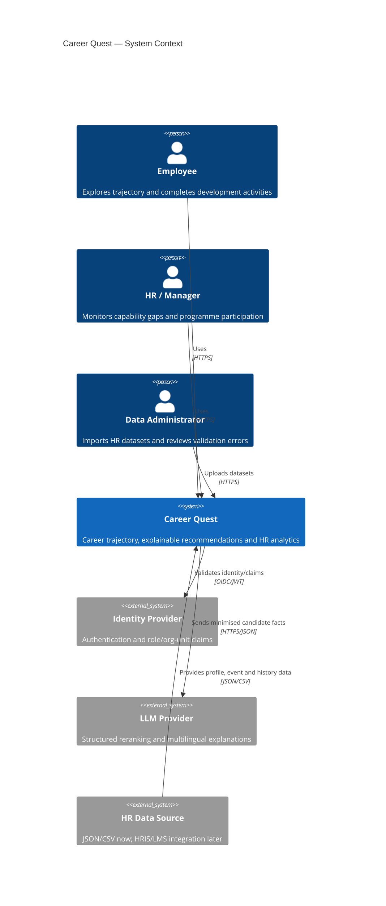
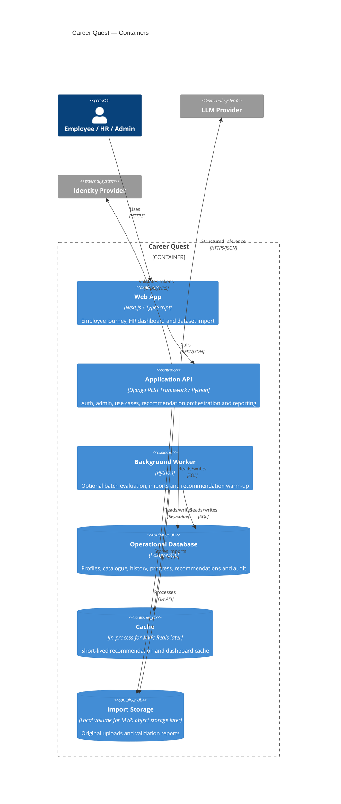
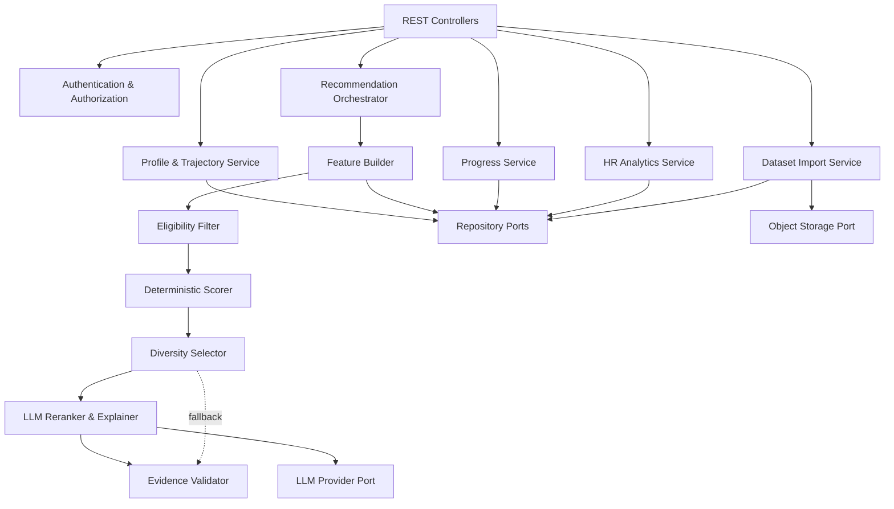
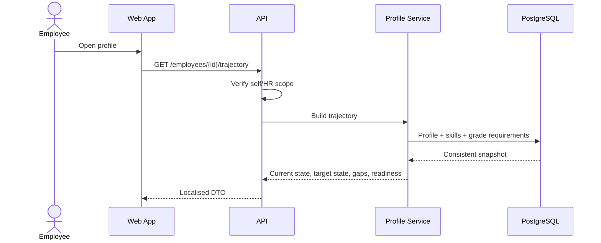
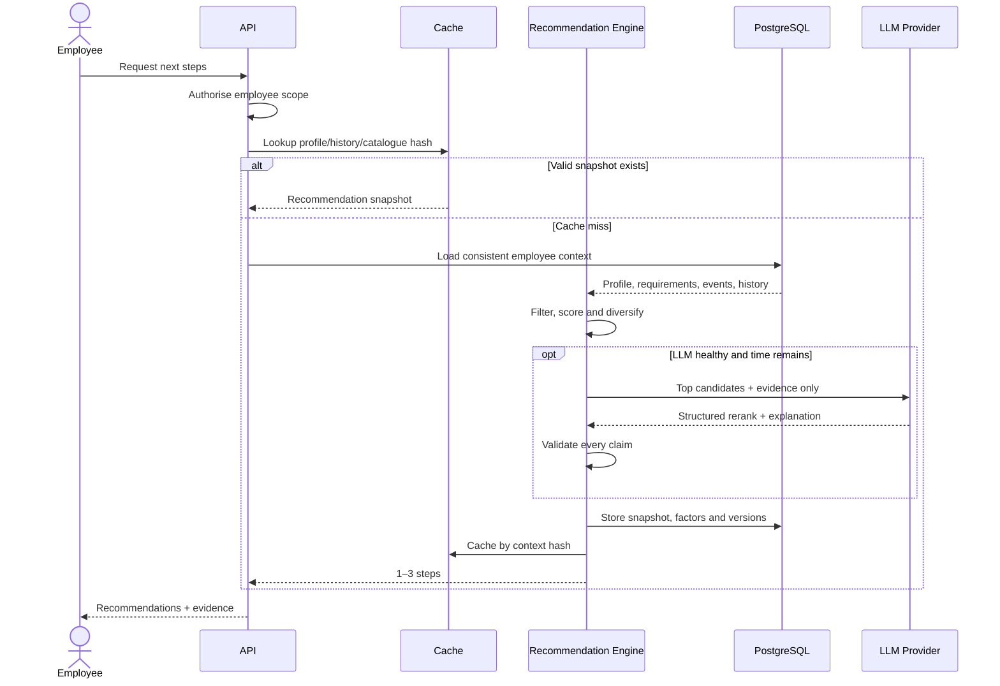
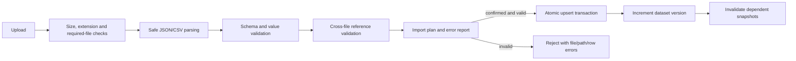
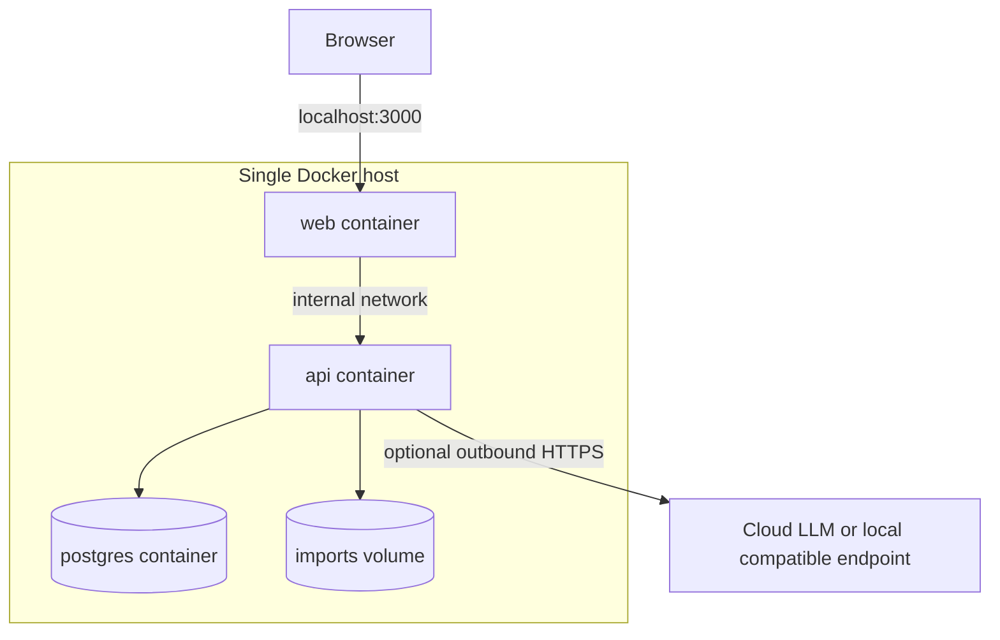
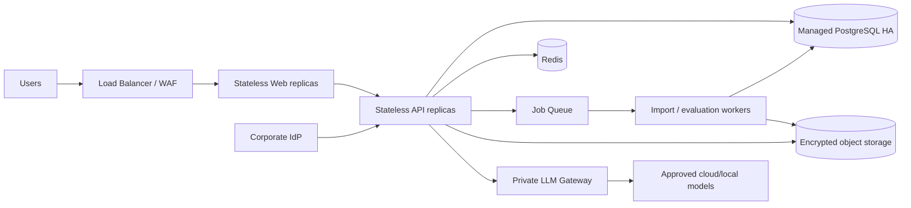
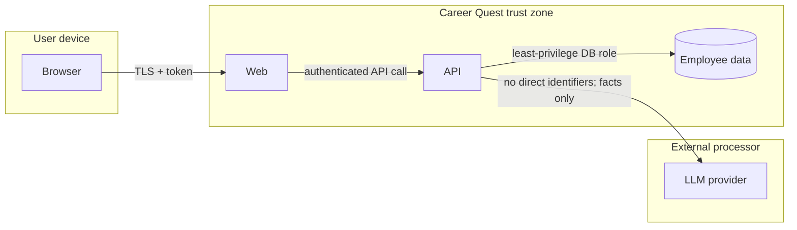

# Career Quest: High-Level System Design

## 1. System objective

Career Quest turns employee profile, skill requirements, activity catalogue and participation history into an explainable career trajectory and 1–3 next-step recommendations. It also gives HR an aggregated view of skill gaps and programme participation.

The main design goals are:

- recommendations use grade, skill gaps, history and next-grade requirements together;
- every recommendation is traceable to facts and a scoring version;
- progress updates follow the dataset's exact `gain` and `max_level` rules;
- new judge profiles can be imported without code changes;
- core flows remain available when an external LLM is slow or unavailable;
- employee-level engagement data is isolated by role and organisational scope;
- the whole system starts with one command.

## 2. Quality attributes

| Attribute | Target / design response |
|---|---|
| Correctness | Deterministic eligibility and skill arithmetic; transactional updates |
| Explainability | Factor contributions, evidence references and engine version stored per recommendation |
| Availability | LLM-independent baseline and cached recommendation snapshots |
| Latency | UI APIs p95 < 500 ms; deterministic recommendations < 1 s; LLM path < 10 s |
| Security | OIDC/JWT-ready RBAC, row-level scope checks and minimised LLM payloads |
| Modifiability | Modular monolith with provider-neutral ports for LLM, auth and persistence |
| Reproducibility | Versioned rules/prompts, seed data, Docker Compose and golden-profile evaluation |

## 3. C4 Level 1: system context



For the hackathon, a demo identity selector replaces the external IdP and files replace HRIS/LMS integration. Both use adapters so production integrations do not change domain logic.

## 4. C4 Level 2: containers



The worker and Redis are deployment options, not MVP requirements. With the hackathon dataset, imports and scoring can run safely inside the API process. Their boundaries are shown because those workloads are the first candidates to separate at production scale.

## 5. API internal component design



### Component responsibilities

| Component | Owns | Must not own |
|---|---|---|
| Controllers | HTTP validation, locale, response mapping | Business scoring rules |
| Auth | Identity, role and organisation-scope policy | Employee recommendation logic |
| Profile & Trajectory | Current/target grade, gaps, readiness | LLM calls |
| Recommendation Orchestrator | End-to-end recommendation workflow and snapshot lifecycle | Direct SQL or provider-specific code |
| Feature Builder | Normalised facts derived from profile/catalogue/history | Ranking decisions |
| Eligibility Filter | Hard audience, prerequisite, availability and completion constraints | Natural-language explanations |
| Deterministic Scorer | Versioned factor calculation and base ranking | Invented facts or free text |
| LLM Reranker | Context-aware ordering and multilingual explanation | Adding candidates or changing skill values |
| Evidence Validator | Schema, candidate-ID and factual-claim validation | Correcting source data |
| Progress Service | Idempotent completion and exact skill update rules | Probabilistic calculations |
| HR Analytics | Aggregated gaps, coverage and participation | Unauthorised individual disclosure |
| Import Service | Schema/reference validation and atomic import | Partial mutation after failed validation |

Dependencies point inward: HTTP, SQL, file storage and LLM clients implement ports defined by application/domain modules. This keeps scoring testable without infrastructure.

## 6. Core data flows

### 6.1 Read profile and trajectory



### 6.2 Generate recommendations



### 6.3 Complete an activity

```mermaid
sequenceDiagram
    actor U as Employee
    participant A as API
    participant P as Progress Service
    participant D as PostgreSQL
    participant C as Cache

    U->>A: POST completion + Idempotency-Key
    A->>A: Authorise self and validate event
    A->>P: Complete activity
    P->>D: Begin transaction; lock employee skill rows
    P->>D: Insert completion if key is new
    P->>P: after = min(before + gain, max_level, 5)
    P->>D: Update skills + append skill-change audit
    P->>D: Commit
    P->>C: Invalidate employee recommendation/trajectory
    P-->>A: Before/after and new readiness
    A-->>U: Updated progress
```

### 6.4 Import judge dataset



## 7. Data ownership and consistency

PostgreSQL is the system of record. Each write use case owns its transaction boundary:

- the Import Service owns catalogue/profile/history batch changes;
- the Progress Service owns completion, skill changes and their audit log;
- the Recommendation Orchestrator owns immutable recommendation snapshots.

`dataset_version`, `employee_state_version`, `engine_version` and `prompt_version` make a recommendation reproducible. A cache key is derived from these versions, not only from employee ID.

Strong consistency is required for completion and import. Eventual consistency is acceptable for cached HR aggregates and recommendation warm-up, because the API can always recompute from PostgreSQL.

## 8. Deployment topology

### Hackathon deployment



This topology optimises reproducibility: `docker compose up --build` starts all mandatory services, and missing LLM credentials activate deterministic mode.

### Production evolution



The evolution needs no domain rewrite: repository, object-store, cache, auth and LLM adapters change independently.

## 9. Trust boundaries and data privacy



Controls at the boundaries:

- the API, not the UI, enforces employee/self, HR/org-unit and admin policies;
- employee IDs sent to an LLM become per-request opaque IDs;
- names, contacts, org metadata and raw free-text history are excluded;
- LLM output is untrusted input and passes schema/evidence validation;
- HR metrics use a minimum cohort size and expose individual details only under explicit role policy;
- imports are synthetic in the hackathon and are not exported from the environment;
- secrets remain in environment/secret storage and never enter logs or recommendation snapshots.

## 10. Failure modes and graceful degradation

| Failure | Detection | System response |
|---|---|---|
| LLM timeout/unavailable | Adapter timeout/circuit breaker | Return deterministic ranking with template explanation |
| Invalid/hallucinated LLM output | JSON Schema and evidence validation | Discard LLM response; use deterministic result |
| Duplicate completion request | Unique idempotency key | Return original successful result without applying gain twice |
| Invalid dataset/reference | Pre-commit validation | Reject entire import and return precise error report |
| API restart | Health checks | Stateless restart; recover from PostgreSQL |
| Stale recommendation | Version/hash mismatch | Recompute before returning |
| Cache unavailable | Cache adapter error | Read/recompute using PostgreSQL |
| No eligible activities | Empty eligible set | Explain constraints and flag coverage gap to HR; never invent an event |
| Concurrent completions | Row lock/version check | Serialise skill updates and preserve exact before/after audit |

## 11. Scaling strategy

The hackathon volume fits comfortably in one API instance. Scaling is deliberately incremental:

1. Add database indexes on employee/history/event foreign keys and `(role, grade)` requirements.
2. Cache immutable catalogue data and version-keyed recommendation snapshots.
3. Scale stateless Web/API replicas horizontally.
4. Move imports, batch evaluations and warm-up to queue-backed workers.
5. Add PostgreSQL read replicas for HR analytics if aggregate traffic grows.
6. Extract the Recommendation Engine only if it needs independent GPU/model lifecycle or materially different scaling.

The design avoids premature microservices while preserving component boundaries required for later extraction.

## 12. Observability

Each request carries a `request_id`; recommendation requests also receive a `decision_id`. Structured telemetry includes:

- endpoint latency, status and authenticated role without personal fields;
- recommendation duration by feature/scoring/LLM/validation stage;
- LLM timeout, invalid-output and fallback rates;
- cache hit ratio and snapshot age;
- recommendation coverage and no-eligible rate;
- import validation failures by category;
- completion success, conflict and idempotent-replay counts.

For every recommendation, an audit snapshot stores candidate IDs, selected IDs, factor contributions, evidence references, dataset/engine/model/prompt versions and timestamps. It does not store secrets or unnecessary personal data.

## 13. Capacity assumptions

Initial dataset: 200 employees, 40 events, 60 skills and 24 months of history. The architecture assumes up to tens of thousands of employees without redesign because scoring is per employee over a bounded event catalogue and HR analytics is relational aggregation.

At larger scale, recommendation work is approximately `O(eligible events × relevant skills)`. It is reduced by audience/availability indexes, precomputed grade-gap features and versioned snapshots. An LLM sees only top-N candidates, keeping token cost and latency bounded independently of catalogue size.

## 14. Key design invariants

1. An LLM can reorder eligible candidates but cannot create one.
2. Every displayed numerical claim must resolve to stored evidence.
3. Skill progress changes only through a versioned deterministic rule.
4. A completion can affect an employee at most once.
5. An invalid import changes no operational data.
6. Authorisation is checked server-side on every employee-scoped operation.
7. The core employee flow works without an external AI provider.
